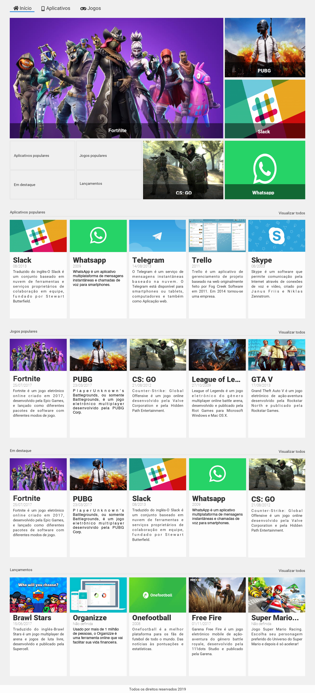

# [Alura Store](https://amandavsadev.github.io/alura-store/) | HTML e CSS.

## :page_facing_up: Sobre o Projeto
- Este projeto foi desenvolvido no decorrer do curso 'CSS Grid: simplificando layouts' proporcionado pela [Alura](https://github.com/alura-cursos) com o obejto de por em prática os conhecimentos obtido durante as aulas.
- Criado em 22/11/2022
---
## :framed_picture: Imagens do Projeto

---
# [Alura SPA](https://amandavsadev.github.io/alura-spa/) | HTML e CSS.

## :page_facing_up: Sobre o Projeto
- O projeto foi desenvolvido através do curso "SASS: CSS sintaticamente espetacular" proporcionado pela [Alura](https://github.com/alura-cursos) e pelo professor [Guilherme Lima](https://github.com/guilhermeonrails), com o intuito de pôr em prática os conhecimentos sobre pré-processadores (SASS) obtidos em aula.
- Criado em 23/11/2022
---
## :framed_picture: Imagens do Projeto

## :woman_technologist:  Autora

<table class="author">
  <tr>
    <td align="center">
      <a href="https://github.com/amandavsadev">
        
         
        
          <b>Amanda Amorim</b>
        
      </a>
    </td>
  </tr>
</table>   
   LinkedIn: https://www.linkedin.com/in/amandavsamorim/  
   Telegram: https://t.me/amandavsamorim
   
   E-mail: amandavsadev@gmail.com
   
  ## 📝 Licença
  
   O projeto o possui a licença _MIT_, veja o arquivo [license](LICENSE.txt) para mais informações.

