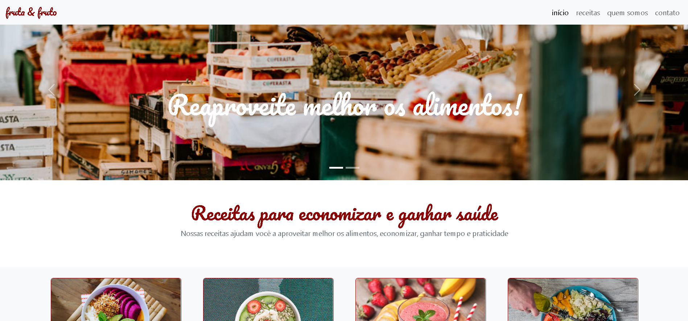
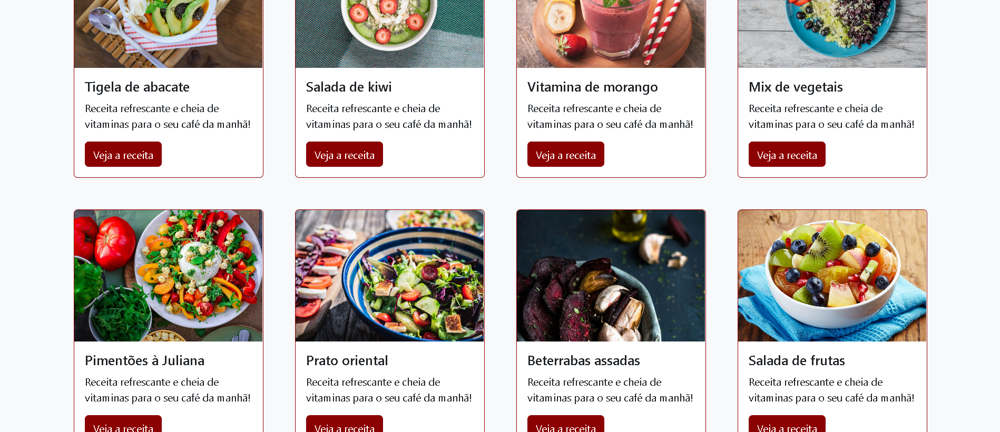
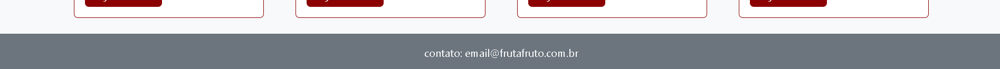

# [Fruta & Fruto](https://amandavsadev.github.io/fruta-e-fruto/) | Bootstrap.

## :page_facing_up: Sobre o Projeto
- O projeto Fruta & Fruto foi desenvolvido com a intenção de por em prática os conhecimentos obtidos no curso "Bootstrap 4: criando uma landing page responsiva" proporcionado pela [Alura](https://github.com/alura-cursos).
- [Bootstrap](https://getbootstrap.com/) é um framework front-end que fornece estruturas de CSS para a criação de sites e aplicações responsivas de forma rápida e simples. Além disso, pode lidar com sites de desktop e páginas de dispositivos móveis da mesma forma.
- Criado em 28/11/2022
---
## :framed_picture: Imagens do Projeto

---
##  💻 Tecnologias utilizadas
  * [HTML](https://developer.mozilla.org/pt-BR/docs/Web/HTML) 
  * [CSS](https://developer.mozilla.org/pt-BR/docs/Web/CSS)
  * [JavaScript](https://developer.mozilla.org/pt-BR/docs/Web/JavaScript)
---
## :woman_technologist:  Autora

<table class="author">
  <tr>
    <td align="center">
      <a href="https://github.com/amandavsadev">
        
         
        
          <b>Amanda Amorim</b>
        
      </a>
    </td>
  </tr>
</table>   
   LinkedIn: https://www.linkedin.com/in/amandavsamorim/  
   Telegram: https://t.me/amandavsamorim
   
   E-mail: amandavsadev@gmail.com
   
  ## 📝 Licença
  
   O projeto possui a licença _MIT_, veja o arquivo [LICENSE](LICENSE) para mais informações.
