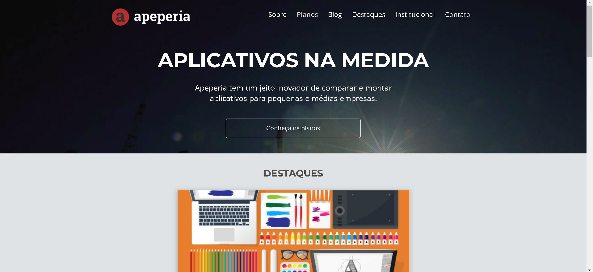
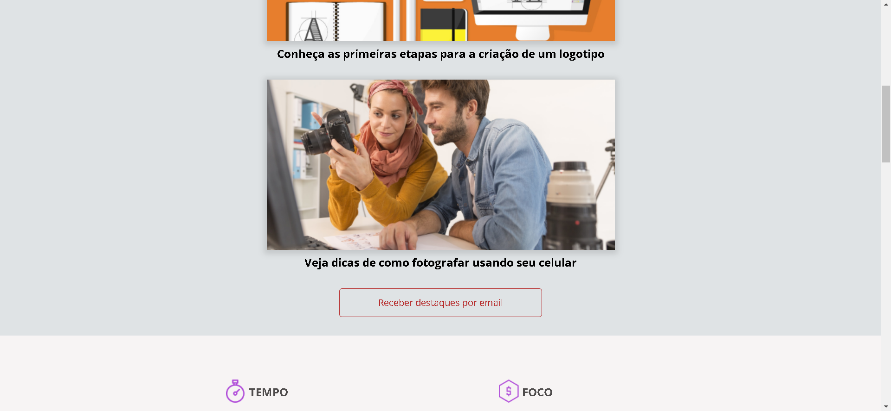
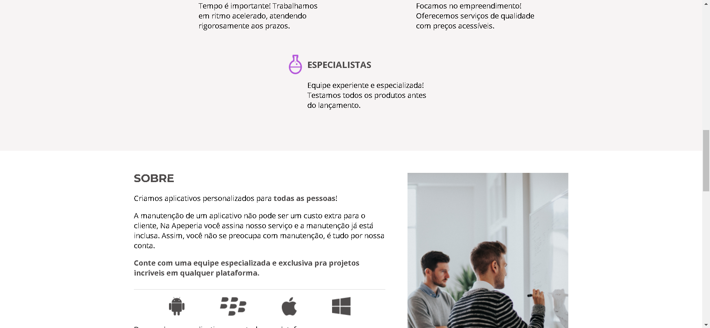
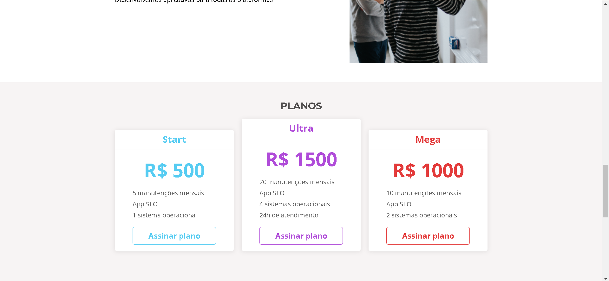
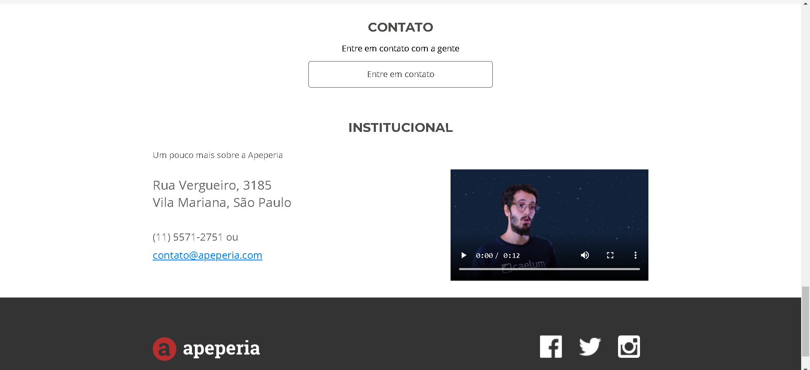

# [Projeto Apeperia](https://amandavsadev.github.io/projetoApeperia/) | HTML e CSS.

## :page_facing_up: Sobre o Projeto
- Este projeto foi desenvolvido através de um curso proporcionado pela [Alura](https://github.com/alura-cursos) com o intuito de colocar em prática os conhecimentos em HTML5, CSS3 e os conceitos de responsividade.
- Criado em 28/10/2022
---
## :framed_picture: Imagens do Projeto

---
## 💻 Tecnologias utilizadas
  * [HTML](https://developer.mozilla.org/pt-BR/docs/Web/HTML) 
  * [CSS](https://developer.mozilla.org/pt-BR/docs/Web/CSS)
---

## :woman_technologist:  Autora

<table class="author">
  <tr>
    <td align="center">
      <a href="https://github.com/amandavsadev">
        
         
        
          <b>Amanda Amorim</b>
        
      </a>
    </td>
  </tr>
</table>   
   LinkedIn: https://www.linkedin.com/in/amandavsamorim/  
   Telegram: https://t.me/amandavsamorim
   
   E-mail: amandavsadev@gmail.com
   
   
  ## 📝 Licença
  
   O projeto o possui a licença _MIT_, veja o arquivo [LICENSE](LICENSE) para mais informações.
